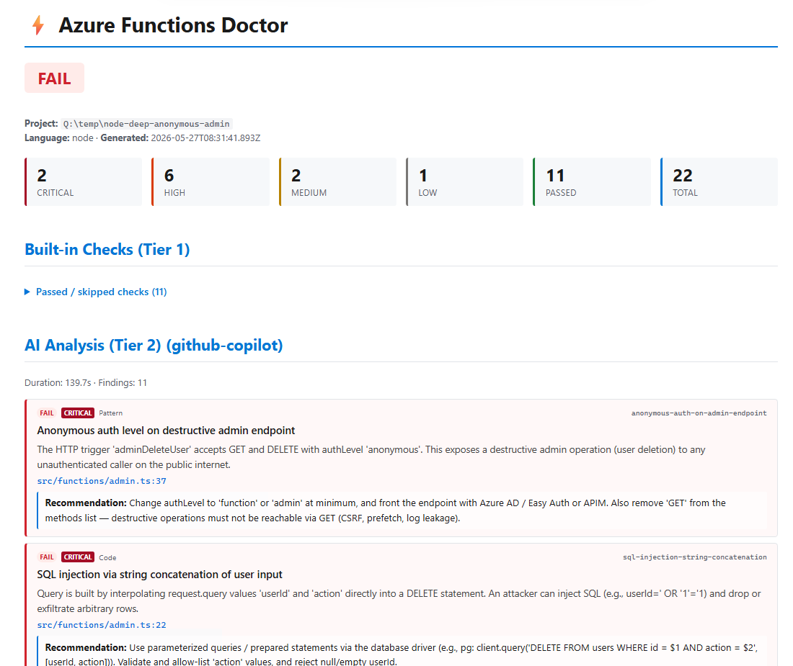

# Azure Functions Skills

[](https://www.npmjs.com/package/@azure/functions-skills)
[](https://azure.github.io/azure-functions-skills/)

**Azure Functions context for your coding agent.** The plugin provides skills, Azure MCP configuration, and telemetry hooks for GitHub Copilot, Claude Code, and Codex. The `doctor` command catches configuration and code issues *before* you deploy.

Latest E2E status: [HTML report](https://azure.github.io/azure-functions-skills/)

## What & why

Azure Functions Skills equips your coding agent with Functions-specific knowledge — trigger/binding patterns, language anti-patterns, runtime versions, deployment best practices — so the agent gives accurate guidance instead of generic advice.

It is **focused on Azure Functions**. For deployment of *any* Azure resource (Functions or otherwise), it delegates to [Azure Skills](https://github.com/microsoft/azure-skills) via the `azure-functions-deploy` skill. The two packages complement each other — see [docs/skills-vs-azure-skills.md](docs/skills-vs-azure-skills.md) for the role split.

## Prerequisites

**Node.js 20+** is the only thing you need to install yourself for the Azure Functions Skills CLI.
Use **Node.js 24+** when installing or testing GitHub Copilot CLI (`--agent ghcp`) because the
Copilot CLI runtime requires Node 24 or later. Claude Code and Codex do not currently require Node
24. Everything else (Azure CLI, Core Tools, language runtimes) is checked and guided by the
`azure-functions-setup` skill when environment verification is needed.

## Quick Start

### 1. Install the plugin with your coding agent

Use the plugin manager built into GitHub Copilot, Claude Code, or Codex to install the `Azure/azure-functions-skills` repository plugin. The npm package does not install or launch coding-agent plugins.

### 2. Ask for Azure Functions help

Open your coding agent normally and ask which Azure Functions workflow to use. `azure-functions-help` discovers the installed `azure-functions-*` skills and routes to the best match.

> **More options?** See [CLI Reference](docs/cli-reference.md) for every command, flag, and headless example.

## Local installs and VS Code extension integration

`install --local` copies skill bodies, MCP settings, and telemetry hooks from the installed `@azure/functions-skills` npm package. It does not copy agent definitions, instruction files, routing files, or prompts.

```bash
npx @azure/functions-skills install --local --agent ghcp --dir ./my-app
npx @azure/functions-skills update --local --agent ghcp --dir ./my-app
npx @azure/functions-skills install --local --agent ghcp --dir ./my-app --no-telemetry
```

VS Code extensions can call the same local install flow from TypeScript:

```ts
import { installLocalSkills } from '@azure/functions-skills/setup';

const result = await installLocalSkills({
  targetDir: workspaceFolder.uri.fsPath,
  agents: ['ghcp'],
});
```

Common options:

| Option | Description |
| --- | --- |
| `targetDir` | Required workspace root where local skills should be installed. |
| `agents` | Optional agents: `ghcp`, `claude`, `codex`. Defaults to GHCP-compatible setup when omitted. |
| `dryRun` | Return planned local files without writing. |
| `checkForUpdates` | Set `false` to skip npm package freshness guidance. |
| `runner` | Optional command runner for tests or extension-host controlled npm checks. |

The result includes installed agents, files written, planned files, dry-run status, and `packageUpdate` guidance that extensions can surface in their own UI.

## Telemetry

Azure Functions Skills collects usage telemetry to understand which bundled skills and Azure Functions MCP tools are used. Events include allowlisted skill/tool names, relative allowlisted Azure Functions skill-file paths, client name, session id, and timestamp. Telemetry does **not** include file contents, prompts, raw tool arguments, credentials, or absolute paths. Events are sent by the `@azure/functions-skills` package directly to the Azure Functions team's Application Insights resource; the package does not use Azure MCP as a telemetry destination or transport.

For host-managed plugin installs, opt out by setting either
`AZURE_FUNCTIONS_SKILLS_COLLECT_TELEMETRY=false` or `AZURE_MCP_COLLECT_TELEMETRY=false`
in the environment. Workspace-local installs can also use `--no-telemetry`; that preference
is stored in the installed `telemetry.config.json` and preserved by local updates.

## Skills

For contributor guidance on the product boundary between Azure Skills and Azure Functions Skills, see [Azure Skills and Azure Functions Skills Boundary](docs/azure-skills-boundary.md).

| Skill | Purpose |
| --- | --- |
| [`azure-functions-help`](templates/skills/azure-functions-help/SKILL.md) | Discover and route to the best Azure Functions skill |
| [`azure-functions-setup`](templates/skills/azure-functions-setup/SKILL.md) | Verify local prerequisites (Azure CLI, Core Tools, runtimes, Azure Skills) |
| [`azure-functions-create`](templates/skills/azure-functions-create/SKILL.md) | Create new Functions projects or add functions via Azure MCP templates |
| [`azure-functions-agents`](templates/skills/azure-functions-agents/SKILL.md) | Build Azure Functions hosted AI agent apps, scheduled agents, connector-triggered agents, and chat/API agents |
| [`azure-functions-deploy`](templates/skills/azure-functions-deploy/SKILL.md) | Prepare, validate, and deploy via Azure Skills with Functions-specific guidance |
| [`azure-functions-best-practices`](templates/skills/azure-functions-best-practices/SKILL.md) | Production-readiness review (config, security, reliability) |
| [`azure-functions-diagnostics`](templates/skills/azure-functions-diagnostics/SKILL.md) | Investigate deployment, runtime, trigger, binding, logging issues |
| [`azure-functions-health-status`](templates/skills/azure-functions-health-status/SKILL.md) | Collect current health, metrics, logs, Resource Health, Activity Log |
| [`azure-functions-inventory`](templates/skills/azure-functions-inventory/SKILL.md) | Collect app specification and configuration inventory |
| [`azure-functions-doctor`](templates/skills/azure-functions-doctor/SKILL.md) | Pre-deployment validation (used by the `doctor` CLI command) |
| [`azure-functions-common`](templates/skills/azure-functions-common/SKILL.md) | Shared language, trigger, binding, extension, routing references |
| [`azure-functions-feedback`](templates/skills/azure-functions-feedback/SKILL.md) | Turn session findings into previewed issues or pull requests |

The `azure-functions-help` skill provides the discovery and routing entry point.

## Doctor — pre-deployment validation

Catch configuration mistakes, deprecated settings, **and semantic code issues** (missing error handling, blocking I/O, hardcoded secrets, durable-orchestrator non-determinism) *before* you deploy. The LLM semantic analysis is the value — `doctor` ships it as both a local CLI command and a GitHub Actions step.

### Local — LLM analysis + visual HTML report

```bash
npx @azure/functions-skills doctor --dir . \
  --deep --accept-deep-risk \
  --agent github-copilot \
  --format html --output doctor-report.html
```

`--accept-deep-risk` acknowledges that the agent runs with elevated permissions (file write, shell execution) — only use on trusted workspaces. Skip the LLM with `--no-deep` for fast deterministic checks only.

Open `doctor-report.html` in a browser:



### GitHub Actions — pre-deploy gate with deep analysis

Trigger on `push: main` (post-merge), not on pull requests — `--deep` refuses to run on pull-request workspaces because PR code is untrusted (it can prompt-inject the agent). See [docs/doctor-guide.md#security-model](docs/doctor-guide.md#security-model).

```yaml
on:
  push:
    branches: [main]

jobs:
  deep-doctor:
    runs-on: ubuntu-latest
    environment: trusted-deep-analysis  # GitHub Environment for approval + scoped secret
    steps:
      - uses: actions/checkout@v4
      - uses: actions/setup-node@v4
        with:
          node-version: '22'
      - name: Install GitHub Copilot CLI
        run: npm install -g @github/copilot
      - name: Run Azure Functions doctor
        env:
          GITHUB_TOKEN: ${{ secrets.COPILOT_TOKEN }}
        run: |
          npx @azure/functions-skills doctor \
            --deep --accept-deep-risk \
            --agent github-copilot \
            --format markdown --output doctor.md \
            --severity high
      - name: Publish summary
        if: always()
        run: cat doctor.md >> $GITHUB_STEP_SUMMARY
```

Exit code is `1` if any finding is at or above `--severity` (default `high`), gating downstream deploy steps. For PR validation, use the same command with `--no-deep` (Tier 1 only) on `pull_request` events.

> **Doctor walkthrough?** See [docs/doctor-guide.md](docs/doctor-guide.md) for Tier 1 vs Tier 2 details, output formats, deep mode security, and bad-app fixtures.

Doctor also includes **supply-chain security checks** (lifecycle scripts, unpinned production dependencies, missing lockfile, tracked `.env` files, install-script deps, plus Tier 2 semantic checks for import-time side effects, fetch-then-execute, and credential exfiltration patterns) — informed by recent npm and PyPI compromises. See [SECURITY.md](SECURITY.md) for the threat model.

## Contributing

We welcome contributions. The canonical source for skills, telemetry hooks, and MCP definitions lives under [`templates/`](templates/) — edit there, then `npm run build:plugin-payload` to regenerate the published plugin payload.

Read [CONTRIBUTING.md](CONTRIBUTING.md) for the full guide.

## Security

Report vulnerabilities to [secure@microsoft.com](mailto:secure@microsoft.com). See [SECURITY.md](SECURITY.md) for the threat model and our defense layers.

## License

[MIT](LICENSE)
