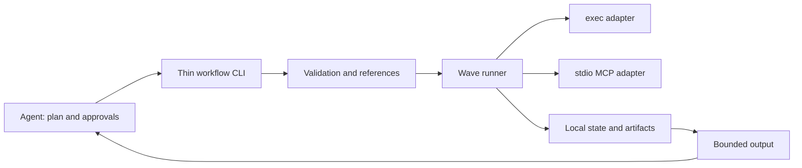

# FRD-0001: Local workflow runner

| Metadata | Value |
| --- | --- |
| Status | Implemented |
| Revision | 3 |
| Created | 2026-09-07 |
| Updated | 2026-09-07 |
| Author | GitHub Copilot, with requirements from Tsuyoshi Ushio |
| Depends on | None |
| Related | [F21: Template Apply](../prd-docs/f21-template-apply-cli-library.md), [FRD-0002: Evaluation](0002-workflow-create-deploy-evaluation.md) |

## 1. Summary

Add an experimental `azure-functions-skills workflow` command that executes a
JSON DAG of external commands and explicitly configured stdio MCP calls without
calling an LLM. The agent plans and handles unfamiliar failures; the runner
executes predictable work, stores intermediate outputs locally, and returns a
bounded result. The feature remains isolated so it can later be removed or
extracted into a separate CLI. This document is a proposal, not an implemented
capability or a claim of measured token savings.

## 2. Motivation / problem

After a user has chosen a language, template, or deployment target, many agent
turns simply execute known commands and pass results to the next command.
Returning large MCP responses through the model can cost more than the actual
decision-making: the create skill documents template responses exceeding 100 KB.

Batching is already useful in this repository. Inventory has a bundled script;
the template CLI avoids full template contents in the transcript. A DAG is not
automatically better than either. The additional value sought here is reusable
execution with dependencies, small recovery policies, and explicit reuse of
successful work after an agent replans.

The reference implementation is Azure Functions Agents Runtime at
`1351d6e79905399d9338ee8c1dd0092ed945a8f0`:

- [The engine](https://github.com/Azure/azure-functions-agents-runtime/blob/1351d6e79905399d9338ee8c1dd0092ed945a8f0/src/azure_functions_agents/workflows/engine.py#L1-L18)
  uses waves of ready tasks and explicitly excludes retries/per-task timeouts.
- [Plan input](https://github.com/Azure/azure-functions-agents-runtime/blob/1351d6e79905399d9338ee8c1dd0092ed945a8f0/src/azure_functions_agents/workflows/tools.py#L159-L169)
  provides tasks, not a public successful-result import/replan API.
- [Status output](https://github.com/Azure/azure-functions-agents-runtime/blob/1351d6e79905399d9338ee8c1dd0092ed945a8f0/src/azure_functions_agents/workflows/tools.py#L237-L260)
  passes through orchestration output rather than producing a bounded summary.
- [Tool execution](https://github.com/Azure/azure-functions-agents-runtime/blob/1351d6e79905399d9338ee8c1dd0092ed945a8f0/src/azure_functions_agents/workflows/engine.py#L1051-L1070)
  invokes registered handlers; it is not a generic MCP connection adapter.

Borrow DAG scheduling and typed result references, not the entire runtime.
Durable replay and importing successful results into a revised DAG are different
features. This proposal adds its own retry, timeout, reuse, and output contracts.

## 3. Goals / non-goals

### Requirements and acceptance criteria

| ID | Requirement | Observable acceptance criterion |
| --- | --- | --- |
| WR-001 | Standalone, removable runner | Workflow modules do not depend on setup, doctor, Azure business logic, host-agent SDKs, or an LLM |
| WR-002 | Strict versioned DAG validation | Unsupported fields/version, duplicate IDs, missing dependencies, cycles, and invalid references fail before execution |
| WR-003 | Execute commands and explicit stdio MCP calls | Real CLI and local MCP fixtures complete; MCP `isError` is a failure |
| WR-004 | Bounded recovery and scheduling | Configured retry and one fallback work; unrecovered failure prevents the next wave |
| WR-005 | Conservative uncertain outcomes | Timeout, interrupted execution, and post-send connection loss never trigger automatic replay |
| WR-006 | Persist results and explicitly reuse success | A revised run reuses only requested matching successful nodes and their dependency closure |
| WR-007 | Keep intermediate payloads out of context | Large outputs pass through artifacts; summary and inspect honor byte limits and remain valid JSON |
| WR-008 | Preserve existing behavior and boundaries | Existing commands/skill routes remain unchanged; workflow state is created only by workflow execution |
| WR-009 | Actionable, safe execution records | Per-node receipts are persisted and bounded reads expose attempts/errors/provenance without resolved secrets; invalid plans or artifacts are not hidden as success |
| WR-010 | Explicit-use agent guidance | A short dedicated skill explains planning, approval, failure inspection, and reuse without modifying the user-facing AGENTS template |

### Non-goals

Durable Functions, a database, daemons, queues, cloud orchestration, runner-owned
LLM/subagent calls, arbitrary expressions, loops/foreach, nested DAGs, rollback,
exactly-once execution, generic file merging, HTTP/OAuth MCP, host MCP session
reuse, an approval UI, or automatic migration of existing skill routes.

Actual create/deploy measurements belong to FRD-0002. Parallelism is an elapsed-time
optimization, not evidence of token savings.

## 4. Proposed design

### Architecture and ownership



Keep implementation in `src/workflow/`: `index.ts`, `plan.ts`, `references.ts`,
`runner.ts`, `store.ts`, `report.ts`, and `adapters/exec.ts` / `adapters/mcp.ts`.
Small executor/store interfaces permit fixtures and later extraction. Do not add
a plugin registry or dependency-injection framework.

The existing `bin/azure-functions-skills.js` adds a thin dynamic-import dispatch.
Put option parsing in `bin/workflow.js` if needed. No public library export or
separate npm package is required initially.

Use a pinned stable official MCP TypeScript SDK, not its development branch.
Use `cross-spawn` as a direct dependency for command portability rather than
importing the SDK's transitive copy or depending on doctor's private resolver.
Confirm Node compatibility and peer dependencies before changing manifests.

### CLI

```powershell
azure-functions-skills workflow validate --plan .\plan.json --dir .\app
azure-functions-skills workflow run --plan .\plan.json --dir .\app --mcp-config .\workflow-mcp.json
azure-functions-skills workflow status --run <run-id> --dir .\app
azure-functions-skills workflow inspect --run <run-id> --node <node-id> --dir .\app
azure-functions-skills workflow tools --mcp-config .\workflow-mcp.json --server azure --tool <name>
azure-functions-skills workflow run --plan .\revised.json --from <run-id> --reuse prepare,build --dir .\app
```

`validate` is static and never starts commands or MCP servers. `run` always
validates before execution and runs in the foreground. `status` and `inspect`
read saved state without resuming it. `tools` explicitly starts the configured
server and handles tools/list pagination; return names by default and the
selected schema with `--tool`.

Default stdout is compact JSON; `--format text` is for humans. Progress goes to
stderr, never into JSON stdout. Exit codes: 0 success, 1 execution failure or
unknown outcome, 2 invalid input/configuration/reuse, 130 interruption. Reading a
failed run with status/inspect still exits 0 if the read itself succeeds.
Callers must inspect the JSON status to distinguish failure from unknown; exit
code 1 alone is not permission to retry.

Resolve plan/config paths relative to the invocation cwd and plan action cwd
relative to `--dir`. Store state under
`.azure-functions-workflows/runs/<run-id>` in the target workspace. Install/update
must not create or manage this directory.

### Plan, references, and output

```json
{
  "version": 1,
  "maxConcurrency": 1,
  "nodes": [
    {
      "id": "account",
      "replaySafe": true,
      "action": {
        "kind": "exec",
        "command": "az",
        "args": ["account", "show", "--query", "{id:id,name:name}", "-o", "json"],
        "output": "json"
      },
      "exports": {"subscriptionId": "/id"}
    },
    {
      "id": "groups",
      "dependsOn": ["account"],
      "replaySafe": true,
      "action": {
        "kind": "exec",
        "command": "az",
        "args": ["group", "list", "--subscription", {"$ref": "account.subscriptionId"}, "-o", "json"],
        "output": "json"
      }
    }
  ],
  "outputs": {"subscriptionId": {"$ref": "account.subscriptionId"}}
}
```

Nodes have an ID, dependencies, an action, and optional exports, timeout, retry,
fallback, and replay-safety declaration. Accept JSON only. Node IDs match
`^[a-z][a-z0-9-]{0,63}$`; export names match `^[A-Za-z][A-Za-z0-9_]{0,63}$`.
This excludes path separators, dot-reference ambiguity, and commas in the
comma-separated `--reuse` list. Run IDs are runner-generated opaque identifiers
validated as single safe path segments, not caller-supplied paths.

An export maps a name to a JSON Pointer in the action's successful data. A
`{"$ref":"node.export"}` object preserves the referenced JSON type. The referenced
node must be an explicit dependency of the consumer. Do not interpolate shell
strings, evaluate expressions, silently substitute null, or stringify objects
into command arguments. Resolved exec arguments must be strings.

An MCP action has `kind: "mcp"`, `server`, `tool`, and `arguments`. Discover actual
tool names/schemas rather than guessing host aliases. Structured content supplies
data; parsing JSON from text requires an explicit output option. An exec action
parses stdout only with `output: "json"`. Invalid JSON or missing exports is an
explicit output failure, not successful empty data.

Top-level `outputs` selects named exports for the final report. Intermediate
exports are not automatically exposed. On overall failure, distinguish available
outputs from unavailable names.

Store exec stdout/stderr and MCP CallToolResult JSON as artifacts. An exec action
may use `stdinFrom: "<dependency-node-id>"` to stream a dependency's primary
artifact into an approved script: exec stdout or MCP CallToolResult JSON. This
keeps large templates off the model path without making the runner a file-merger.

### Scheduling, retry, fallback, and unknown outcomes

Default concurrency is 1; allow 1-8 with at most 50 nodes. Execute ready nodes in
waves. Save each result immediately, wait for the active wave to settle, and
start no further wave after an unrecovered failure. Do not kill a sibling that
may be completing a side effect simply because another node failed.

Default timeout is 300 seconds per attempt and default retry is disabled.
`retry` has `maxAttempts` (1-3, including the initial attempt), finite `delayMs`,
and an explicit list of normalized error codes. Preserve native exit/error
details separately. Do not guess that an error is transient.

After matching retries are exhausted, `fallback: {on: [...], action: {...}}` may
run one alternative action. It must satisfy the same exports. No nested fallback,
retry of the fallback itself, or successful constant substitute for missing data.
Record the primary failure and `usedFallback: true` when the alternative succeeds.

`replaySafe` defaults to false. Retries and potentially duplicating fallbacks
require an explicit read-only/idempotent declaration covering the node's actions,
unless execution is known not to have started. This declaration is not an
automatic proof of safety.

Timeout, interruption, or loss of a response after sending an operation yields
`unknown`, even for a declared replay-safe action. Do not retry or fall back
automatically. The agent must inspect the external state and replan.

Persist running state, then a terminal result of succeeded, failed, or unknown.
After failure, dependent unstarted nodes are blocked and unrelated unstarted
nodes are notStarted. Process/output-limit termination must not imply that an
external side effect was canceled.

### Persistence and revised runs

Each run saves an immutable plan snapshot, state, and per-node attempt artifacts.
Persist a machine-readable receipt per attempt with node ID, primary/fallback
action reference into that snapshot, start/end timestamps, status, native
exit/error code, artifact digests, and fallback/reuse provenance. A reused node
identifies the source run/node rather than claiming a new execution. The action
reference identifies the executable or server/tool and the authored argument
structure; never persist expanded secret values or an environment dump.

`inspect` supports bounded receipt reads as well as artifact reads. Receipts
record execution decisions and outcomes, not cryptographic proof of external
effects; the evaluation harness independently probes those effects.

Write running before starting a side effect. Persist artifacts/results before
marking success; use atomic replacement and a single writer. Persistence errors
stop execution. Record owner-process information and never import from an active
run. Orphaned running nodes are unknown; ambiguous ownership or corrupt state is
an actionable error.
Owner identity includes process ID and process start identity/time where the OS
supports it. A reused PID or unverifiable owner must not authorize importing an
apparently orphaned run.

A revised run is new, not an in-place edit. `--from` plus `--reuse` explicitly
selects successes. Keep selected nodes in the revised plan and require:

| Check | Required behavior |
| --- | --- |
| Status | Only complete, recorded succeeded results qualify |
| Definition | Action, references, exports, retry/fallback, dependencies, cwd, and other execution settings match |
| Ancestors | Every ancestor is also an unchanged imported success from the same source run |
| Scope | Normalized workspace and explicit MCP execution configuration match |
| Artifacts | Referenced files exist and their digests match |
| Ownership | Source run is not executing |

Reject invalid reuse before any work. Never silently reexecute a node that the
caller requested to reuse. Copy the imported artifacts into the new run so
deleting the old run does not invalidate it.

Copying the old plan and editing only failed/pending work avoids regenerating
the entire DAG through the model. A changed upstream invalidates downstream
reuse; independent unchanged successful branches remain eligible.

Definition equality cannot prove that files, credentials, environment values,
executables, or cloud state are unchanged. Reuse is also the agent's explicit
assertion that the prior work remains valid. There is no automatic cache across
workspaces, no success-marking command for unknown nodes, and no exactly-once
guarantee across the external-operation/local-checkpoint crash window.

### Adapters, limits, and trust boundaries

MCP config explicitly maps server IDs to stdio commands, arguments, and
environment-variable-name mappings. Do not search host configuration, extract
credentials, or borrow a host's active MCP session. Reuse one connection per
server within a run and serialize that server's calls initially. Use SDK
initialization and shutdown; do not automatically resend after connection loss.
Reject sampling, elicitation, interactive login, and unsupported transports.

Commands accept an executable and argument array, not a shell command string.
Use `shell: false`; explicitly approved scripts may use their interpreter.
Windows shims can internally require cmd.exe, so do not promise a shell process
never exists. Verify quoting with real shims and special-character arguments.
Manage only processes started by this run; inability to establish termination
must not be reported as a canceled external operation.

Default report limits are 8 KiB for summary and 16 KiB per inspect response.
Return valid JSON with artifact references/truncation indicators rather than
cutting JSON mid-stream. Support bounded offset/limit reads. Summary includes
counts, selected outputs, brief errors, reuse candidates, and artifact locations,
not all successful stdout or all MCP schemas.

Bound raw output and parsed payloads to 16 MiB per artifact and persisted run
data to 128 MiB, including imported artifacts. Exceeding a limit is not a
successful partial result. Stream command logs to disk. MCP SDK framing/parsing
still occurs inside the SDK; the response limit is enforced at the adapter
boundary, not claimed as a hard pre-parse memory sandbox.

The runner is not a sandbox. Executing a plan authorizes multiple operations
under the caller's OS/Azure permissions. Static validation is not a security
approval. Plans, configs, and tool outputs remain untrusted data; constrain
runner-owned paths and reject path traversal, without claiming arbitrary
executables cannot access outside the workspace.

Do not put secret values in plans or persisted environments. Raw artifacts may
contain secrets: keep them local, access-controlled, excluded from git, and
removable. Do not send raw arguments or outputs through existing telemetry.
Never use the runner to bypass Azure Skills validation/approval or host policy.

### Guidance and delivery checkpoints

A short `azure-functions-workflow` skill supports explicit runner/replan requests.
Put detailed schema/examples in references. Do not change existing skill routes
or `templates/agents/AGENTS.md`. Prefer an existing one-shot command/script when
a DAG adds no value.

The agent stops at decisions/approvals, reads summary first, inspects only relevant
failures, and checks uncertain side effects before replanning. It does not repeat
an unchanged failed plan indefinitely.

After this FRD is finalized: implement contract and executor slices, complete
state/reuse and CLI behavior, then demonstrate local fixtures and review against
the requirements. Sample development and live measurements follow FRD-0002.

### Open questions

| Item | Owner / resolution gate |
| --- | --- |
| Implementation dependencies | Pin MCP SDK 1.30.0, cross-spawn 7.0.6, and a compatible stable Zod peer; retain the existing Node policy |

## 5. Decisions log

| ID | Decision / options | Choice and rationale | Decided by | Date |
| --- | --- | --- | --- | --- |
| D-001 | Durable or local executor | Local deterministic runner; minimize infrastructure | Tsuyoshi Ushio, user requirement | 2026-09-07 |
| D-002 | Host MCP reuse or explicit connection | Explicit MCP config; stdio first | Tsuyoshi Ushio, planning confirmation | 2026-09-07 |
| D-003 | Continue independent branches or stop | Stop new work after recovery exhaustion; explicit validated reuse; no replay of unknown outcomes | Tsuyoshi Ushio, planning confirmation | 2026-09-07 |
| D-004 | Automatic skill adoption or opt-in | Explicit workflow invocation; preserve existing routes | Tsuyoshi Ushio, planning confirmation | 2026-09-07 |
| D-005 | General workflow language or fixed primitives | exec/MCP, typed refs, bounded retry and one fallback | GitHub Copilot, proposal pending FRD approval | 2026-09-07 |
| D-006 | In-place resume or new run | Immutable source plus explicit imported success; retain provenance | GitHub Copilot, proposal pending FRD approval | 2026-09-07 |
| D-007 | Review gaps in execution evidence and parsing | Persist bounded per-node receipts without expanded secrets; specify node/export grammar and ambiguous-owner handling | GitHub Copilot, revision 2 after independent review; pending human approval | 2026-09-07 |
| D-008 | Remaining technical limits | 16 MiB artifacts, 128 MiB persisted run data; MCP SDK is not a memory sandbox | GitHub Copilot, conservative decision under the implementation directive | 2026-09-07 |
| D-009 | Implementation authorization | Proceed with the current FRD scope following the repeated explicit instruction to stop planning and implement; live Azure approval remains separate | User instruction at 2026-09-07T13:46:30-07:00 | 2026-09-07 |

## 6. Test plan

| Requirements | Tests / fixtures | Expected evidence |
| --- | --- | --- |
| WR-001, WR-008 | Module boundaries and existing CLI regression tests | No new dependency from existing domains; install/update unchanged |
| WR-002 | `tests/workflow.test.ts` | Cycles, unknown fields, unsafe IDs, bad refs/types fail before adapters run |
| WR-003 | `tests/workflow.test.ts`, `tests/workflow-mcp.test.ts` | Real child process/local stdio fixture; JSON, MCP errors, shutdown, Windows quoting |
| WR-004, WR-005 | `tests/workflow.test.ts` | Bounded attempts, single fallback, stopped waves, persisted sibling successes, no unknown replay |
| WR-006, WR-009 | `tests/workflow.test.ts` | Unchanged reuse, ancestor invalidation, receipts/provenance, missing/damaged artifacts, owner ambiguity, write errors |
| WR-007 | `tests/workflow.test.ts`, `tests/workflow-cli.test.ts` | Large fixture streams to artifact/stdin; exact byte limits and valid JSON pagination |
| WR-008, WR-010 | `tests/workflow-cli.test.ts` and canonical skill validation | Isolated workspace execution, opt-in guidance, unchanged normal routes |

Use existing Vitest, TDD, compile/lint/typecheck, and plugin payload generation
when templates change. Do not run live Azure or unreviewed LLM evaluations as
part of these deterministic fixtures. FRD-0002 owns token-effectiveness evidence.

## 7. Docs impact

Update `docs/cli-reference.md`, add `docs/workflow-runner.md`, and document
experimental status, approval scope, limits, reuse validity, and cleanup.
Add only the explicit-use canonical workflow skill and its references; regenerate
payloads rather than editing generated files. Add state/artifact ignore guidance.
Keep existing deployment delegation and the user-facing AGENTS template intact.

## 8. Status & sign-off

| Item | Evidence |
| --- | --- |
| Independent architecture review | 2026-09-07: separate Claude Opus 5 review; receipt contract and ID grammar gaps addressed in revision 2 |
| Human approval | User explicitly directed implementation after the approval gate was explained |
| Approved revision and scope | Revision 2 feature scope; revision 3 records conservative technical limits and the implementation directive |
| Approval reference and date | Session instruction at 2026-09-07T13:46:30-07:00: "stop planning and start implementing" and "make good decisions" |
| Implementation reference | `src/workflow/`, `bin/workflow.js`, canonical `templates/skills/azure-functions-workflow/`, and `docs/workflow-runner.md`, submitted together with this FRD |
| Acceptance evidence | `npm run check` passed; real local exec/MCP/CLI fixtures cover the table above. Independent Claude Opus 5 review findings on spawn errors, quota receipts, export integrity and CLI exit codes were fixed with regressions. No model-token or live-Azure effectiveness claim is made. |

The earlier plan approval alone did not authorize implementation. This status
records the subsequent repeated implementation directive, not an approval by the
independent reviewer. Live Azure execution remains separately gated.
